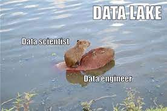

# IAA TP



## How to install project

```shell
>> git clone https://github.com/JaviCeRodriguez/IAA_tpfinal.git
>> cd ./IAA_tpfinal
>> python3 -m virtualenv venv
>> venv/Scripts/activate # or source venv/bin/activate
(venv) >> pip install -r requirements.txt
```

Create `.env` file and put same keys from `.env.example` with his values (or get credentials from [Web API Dashboard](https://developer.spotify.com/dashboard) of Spotify)

## Notebooks

| Título | Ver notebook en colab |
|:-------|:----------------------|
| [Data extraction from Spotify - ETL](ETL_Spotify.ipynb) | [](https://colab.research.google.com/github/JaviCeRodriguez/IAA_tpfinal/blob/main/ETL_Spofiy.ipynb) |
| [Preprocessing data for EDA](Preprocessing_EDA.ipynb) | [](https://colab.research.google.com/github/JaviCeRodriguez/IAA_tpfinal/blob/main/Preprocessing_EDA.ipynb) |

## Explanation

WIP

## ToDo:

✅ Hecho, ⚠️ En progreso, ❌ Sin hacer

#### ETL

- ✅ Conseguir playlists dado un género
- ✅ Conseguir tracks a partir de las playlists
- ✅ Conseguir audio features a partir de los tracks
- ✅ Limpiar dataframes durante todo el proceso y manipular errores (si surgen)
- ⚠️ Documentar procesos
- ✅ Generar script utils/etl.py con funciones usadas en la notebook (y crear las que falten)
- ✅ Ejecutar funciones de utils/etl.py para generar datasets de audio features para cada género

#### Preprocessing (pre EDA)

- ✅ Explorar dataframe
- ✅ Analizar y hacer decisiones sobre tracks con duplicados de géneros y/o con más de uno distintos
- ✅ Generar dataset preprocesado

#### EDA

- ❌ Realizar análisis en géneros seleccionados y obtener estadísticas básicas
- ❌ Analizar si hay ciertos patrones en las audio features
- ❌ Chequear posibles correlaciones
- ❌ Generar un reporte mediante gráficos

#### Model trainning

wip
